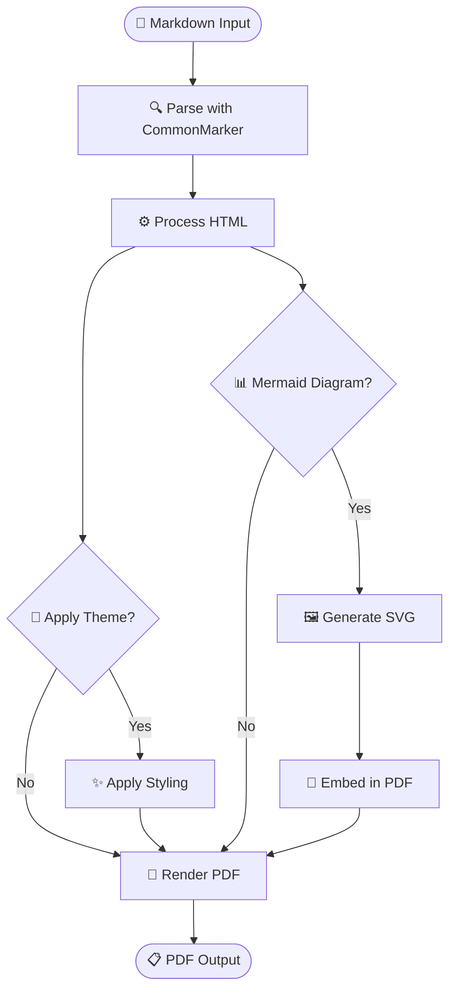
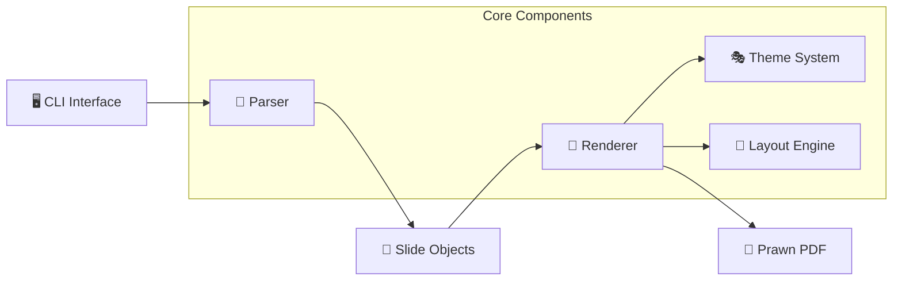

---slide
# 🎯 Showdown Gem
## Portrait Mode Showcase

**Transform Markdown into Beautiful PDF Presentations**

✨ *GitHub Flavored Markdown • Custom Themes • Speaker Notes*

---notes
Welcome to the Showdown gem demonstration! This presentation showcases all the key features available in portrait orientation. Showdown converts markdown files into professional PDF presentations with support for GitHub Flavored Markdown, custom layouts, theming, and much more.

---slide
## 📊 GitHub Flavored Markdown Support

| Feature | Status | Description |
|---------|--------|-------------|
| **Tables** | ✅ | Full table support with headers |
| **Code Blocks** | ✅ | Syntax highlighting with Rouge |
| **Task Lists** | ✅ | Interactive-style checkboxes |
| **Mermaid Diagrams** | ✅ | SVG chart rendering |
| **Rich Formatting** | ✅ | Bold, italic, links, etc. |

---notes
Showdown provides comprehensive GitHub Flavored Markdown support, making it perfect for technical presentations. All standard GFM features are supported including tables, code highlighting, task lists, and even Mermaid diagram rendering.

---slide
## ✅ Task Lists & Formatting

**Project Status:**
- [x] ✨ Basic markdown parsing
- [x] 🎨 Custom slide delimiters (`---slide`, `---notes`)
- [x] 📝 Speaker notes generation
- [x] 🎭 Theme system with YAML configuration
- [x] 📐 Portrait/landscape orientation support
- [x] 📊 Table rendering with prawn-table
- [x] 🎨 Syntax highlighting with Rouge
- [x] 📈 Mermaid diagram SVG rendering
- [ ] 🖼️ Image embedding (coming soon)
- [ ] 🎵 Audio/video links (planned)

**Text Formatting:**
- **Bold text** for emphasis
- *Italic text* for subtle highlights  
- ~~Strikethrough~~ for corrections
- `Inline code` with monospace font
- [Links](https://github.com) are auto-detected

---notes
Task lists are rendered with visual checkmarks, making them perfect for showing project status or feature lists. All standard text formatting is supported and renders beautifully in the PDF output.

---slide
## 💻 Code Highlighting

**Ruby Example:**
```ruby
class Presentation
  def initialize(title, author)
    @title = title
    @author = author
    @slides = []
  end
  
  def add_slide(content, notes = nil)
    @slides << Slide.new(content, notes)
    puts "Added slide: #{content.lines.first&.strip}"
  end
  
  def render_to_pdf(options = {})
    Showdown.convert(self, options)
  end
end
```

**JavaScript Example:**
```javascript
function createPresentation(title, author) {
  return {
    title,
    author,
    slides: [],
    
    addSlide(content, notes) {
      this.slides.push({ content, notes });
      console.log(`Added slide: ${content.split('\n')[0]}`);
    },
    
    renderToPDF(options = {}) {
      return showdown.convert(this, options);
    }
  };
}
```

---notes
Code highlighting is powered by the Rouge gem, supporting over 200 programming languages. Code blocks are rendered with proper syntax highlighting and formatted backgrounds for excellent readability.

---slide
## 📈 Mermaid Diagram Support

**Flowchart Example:**


**System Architecture:**


---notes
Mermaid diagrams are rendered as actual SVG graphics in the PDF, not just code blocks. This makes them perfect for technical documentation, system architecture diagrams, and flowcharts. The diagrams are vector-based, so they scale perfectly at any zoom level.

---slide
## 🎨 Theme System

**Current Theme Configuration:**
```yaml
colors:
  primary: "#2563eb"     # Professional blue
  secondary: "#64748b"   # Subtle gray
  background: "#ffffff"  # Clean white
  text: "#1e293b"       # Dark slate

fonts:
  body: "NotoSans"      # Unicode support
  heading: "NotoSans"   # Consistent typography
  code: "NotoSans"      # Readable monospace

layout:
  margin: 72            # Standard margins
  orientation: "portrait"  # Tall format
  slide_width: 612      # Letter width
  slide_height: 792     # Letter height
```

**Features:**
- 🎨 **Custom Colors** - Define your brand palette
- 🔤 **Font Control** - Choose typography that fits your style  
- 📐 **Layout Options** - Portrait/landscape orientation
- 💾 **YAML Configuration** - Easy to edit and version control

---notes
The theme system allows complete customization of colors, fonts, and layout. Themes are defined in YAML files, making them easy to edit and share. The system supports both portrait and landscape orientations.

---slide
## 📚 Speaker Notes

**What you see here is the main slide content.**

Speaker notes appear in a separate PDF and provide detailed talking points, background information, and presentation guidance.

**Key Benefits:**
- 📝 Detailed explanations for each slide
- 🎤 Talking points and reminders
- 📊 Additional context and data
- 🔗 References and links
- ⏱️ Timing suggestions

---notes
This is an example of speaker notes! These notes appear in a separate PDF file when you use the --notes flag. Speaker notes are perfect for:

1. **Detailed Explanations**: Provide comprehensive background information that doesn't fit on the slide
2. **Talking Points**: List key points you want to cover verbally
3. **Timing Guidance**: Include timing suggestions for each slide
4. **References**: Add links to additional resources
5. **Personal Reminders**: Include personal notes about delivery, emphasis, or stories to tell

Speaker notes support full Markdown formatting, so you can include lists, links, and even code examples in your notes.

---slide
## 🚀 Getting Started

**Installation:**
```bash
# Add to Gemfile
gem 'showdown'

# Install
bundle install

# Or install globally
gem install showdown
```

**Basic Usage:**
```bash
# Initialize new presentation
showdown init

# Convert to PDF
showdown convert presentation.md

# Generate with speaker notes
showdown convert presentation.md --notes

# Use custom theme
showdown convert presentation.md -t themes/custom.yml
```

**File Structure:**
```
my-presentation/
├── presentation.md      # Main content
├── themes/
│   ├── default.yml     # Portrait theme
│   └── landscape.yml   # Landscape theme
└── layouts/
    └── default.erb     # Custom layout
```

---notes
Getting started with Showdown is simple. The `showdown init` command creates sample files to help you understand the structure. You can customize themes, layouts, and content to match your needs. The gem integrates well with existing Ruby projects and can be used in CI/CD pipelines for automated presentation generation.

---slide
## 🎯 Advanced Features

**CLI Options:**
- `-o, --output` - Specify output file name
- `-l, --layout` - Use custom ERB layout template
- `-t, --theme` - Apply custom YAML theme
- `-n, --notes` - Generate separate speaker notes PDF
- `-v, --verbose` - Show detailed processing information

**Slide Delimiters:**
```markdown
---slide
# Your slide content here

---notes
Speaker notes for this slide
```

**Front Matter:**
```yaml
---
title: "Presentation Title"
author: "Your Name"
date: "2025-08-06"
layout: "./layouts/custom.erb"
theme: "./themes/brand.yml"
---
```

---notes
Showdown provides powerful customization options through CLI flags, front matter configuration, and custom layouts. The slide delimiter system makes it easy to structure your presentations, while the front matter allows you to set metadata and configuration options per presentation.

---slide
# 🎉 Thank You!

## Ready to Create Amazing Presentations?

**Next Steps:**
1. 📦 Install the Showdown gem
2. 🚀 Run `showdown init` to get started
3. ✏️ Edit your presentation.md file
4. 🎨 Customize themes and layouts
5. 📄 Generate your PDF with `showdown convert`

**Resources:**
- 📚 Documentation: [GitHub Repository](https://github.com/wernerpetrick/showdown)
- 🐛 Issues & Support: [GitHub Issues](https://github.com/wernerpetrick/showdown/issues)
- 💡 Feature Requests: Welcome via GitHub!

---notes
This concludes our portrait showcase of the Showdown gem. The gem provides a powerful yet simple way to create professional PDF presentations from Markdown files. With support for GitHub Flavored Markdown, custom themes, speaker notes, and Mermaid diagrams, it's perfect for technical presentations, documentation, and more.

Key takeaways:
- Easy to install and use
- Comprehensive GFM support
- Professional PDF output
- Customizable themes and layouts
- Perfect for technical content

Try it out and let us know what you think!
